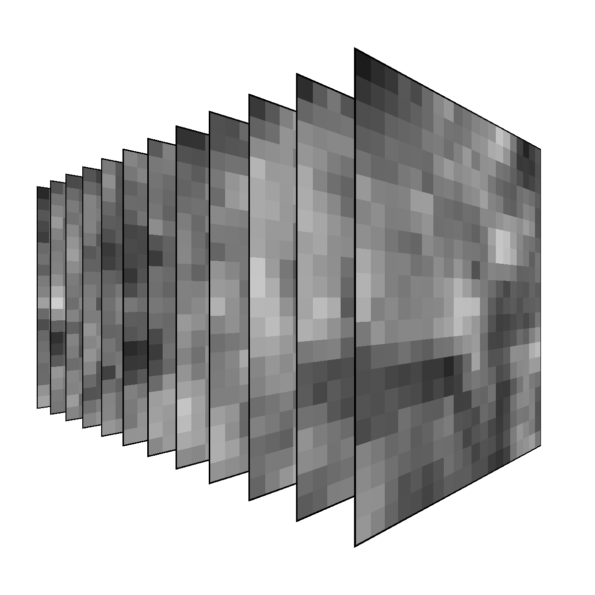

[[ initial port ]]
[[ needs top level arrangement ]]
[[ needs some additional content, notes below ]]
[[ needs in class challenge ]]

[[ show noise in photoshop! ]]


## Noise

[[start with a different image, maybe a grid of squares that look the same, and rewrite about adding varience]

{scale full-width}

Consider the code you would write to draw a colored square. Your code would require several values: horizontal position, vertical position, width, height, the RGB values.

Where do those values come from?

Source          | Purpose
---             | ---
Hard Coded      | You want specific control of the value.
Parameters      | You want to be able to control the value from a larger context.
`random()`      | You want random variation.
`noise(x)`      | You want controlled variation.

[[make a section about Random vs Varied, and how you shouldn't immediately reach for random when you want variation, and how noise is often better than random, really, a lot.]]

[[Make Combinations its own section, mixing approaches is powerful.]]

Often you use these in combination:
`width = 100 + random(-10, 10);`

Using `random()` is a good way to add variation to a value. The `noise(x)` can often offer variation with greater control and consistency.

### Random()


::: js-lab
/comp_form/noise/sketches/sketch_random/sketch.js
/::


### Noise(x)

::: js-lab
/comp_form/noise/sketches/sketch_noise/sketch.js
/::


[[these example need discussion, point out the critical differences]]
[[these examples don't need the code to show, and need better presentation of the DOM UI]]


## Benefits of Noise

### Noise is Coherent
The `noise(x)` function returns values sampled from Perlin Noise. Perlin Noise provides random values that are aesthetically arranged ([band limited and visually isotropic](https://developer.nvidia.com/gpugems/GPUGems/gpugems_ch05.html)) in space. These values are a useful basis for many applications that require natural-feeling variation.

[[needs an english translation "noise that looks good", probably drop the term coherent, as I can't find a good cite for this sense of the word]

### Noise is Repeatable
Repeated variation is easy with `noise(x)`: every time you call `noise(x)` with a particular argument, you get the same value back. This is often very useful. For example, in an animation you often need variation to be consistent from frame to frame.

- `random()` requires no arguments and returns a different random value every time
- `noise(x)` requires an argument and returns the same random value _for that argument_ every time

This difference is a core reason why `noise(x)` is so useful. This difference takes some getting used to, and learning what to pass in for `x` takes some practice.

[[make it clear that you don't have to get repeats, because you can change your _inputs_ to get different _outputs_. if you want the values to change over time, you can make time part of the input]]


### Noise is Controllable
By controlling what you pass to `noise(x)`, you can control the frequency of the values returned. This can be used to control how quickly values vary in space and time. Like `random()` values, you can scale and shift the values from `noise(x)` to the range you need. You can also adjust the character of `noise(x)` using `noiseDetail()`.


[[make it clear that you can't control frequency with random, well not without post filtering]]

### 1D Noise Example
::: js-lab
/comp_form/noise/sketches/sketch_1D_noise/sketch.js
/::

::: .activity
## Building 1D Noise
How does the `noise(x)` function work? Explore the underlying concepts by building a simplified noise function with pencil&nbsp;and&nbsp;paper.

- Review the Linear Congruential Generator worksheet.
- Complete the Linear Congruential Generator (Noise) worksheet.
- Graph the results on the 1D Noise Worksheet.

[[add worksheet downloads]]
/::

### 1D, 2D, + 3D Noise

`noise(x)`


`noise(x, y)`


`noise(x, y, z)`


[[something about patents! something about other noise funcitons!]]


### Qualities of Noise
- Smoothing
- Layering/Octaves/Detail
- Frequency
- Dimensions

[[this needs some support copy]]


## Working with Noise


### Calling the Noise Function

The `noise()` funciton takes up to three parameters: `noise(x,y,z)` allowing you to request values arranged in a three dimensional "cloud" of psuedo-random values.

When you call `noise(x)` you have to pass in at least one coordinate. This represents the location of the value to return. Choose your coordinates based on how you want the value to vary. You can pass in `frameCount` or `millis()` to get values that change over time. You can pass in XYZ coordinates to get values that change over space.


### Controlling the Frequency
You can control the frequency of returned values by scaling the values you pass in for `x`, `y`, and `z`.

```javascript
// get a value that changes over time
n = noise(frameCount); 

// get a value that changes over time slowly
n = noise(frameCount * .1); 

// get a value that changes over time quickly
n = noise(frameCount * 10); 

```

### Controlling the Amplitude and Range
The `noise(x)` function returns values in the range of 0 to 1. Use multiplication and addition to shift this range to the range you need.

```javascript
// scale values to sit between 10 and 20;
n = noise(frameCount) * 10 + 10; 
```

You could also use `map()`:

```javascript
// get values from 0 to 1
n = noise(frameCount); 
// map to 10 to 20
n = map(n, 0, 1, 10, 20);  
```

### Controlling the Detail

::: .links-sidebar
[p5:<br/>noiseDetail()](https://p5js.org/reference/#/p5/noiseDetail)
/::

The `noiseDetail()`  function allows you to control the "roughness" or "detail" of the noise returned. 


### Controlling the Seed

::: .links-sidebar
[p5:<br/>noiseSeed()](https://p5js.org/reference/#/p5/noiseSeed)
/::


By default, every time you restart your sketch the noise pattern will be different. The `noiseSeed()` allows you to manually set the noise pattern seed. 


## Study Examples

::: js-lab
/comp_form/noise/sketches/study_2D.js
/::

::: js-lab
/comp_form/noise/sketches/grass.js
/::

::: js-lab
/comp_form/noise/sketches/skyline.js
/::

[[ in class challenges ]]

##  Slides

::: slides .!short .cover
@@include('./slides.yaml')
/::


::: .assignment

## Keep Sketching!

### Base
This week, focus on using the `noise()` function. Use `noise()` in a variety of ways. Use 1D, 2D, and 3D noise. Try using high, mid, and low frequency noise. Try using noise to control different things: position, size, color, rotation, etc. Think about tile graphics, `random()`, and parameters while you work. Consider combining these concepts with `noise()`.


### Challenge: Treasure Map

Make a program that generates treasure maps.

#### Your maps should

- Describe the geography of a fictional territory
- Mark the location of the treasure
- Include a path to the treasure from a reference point (optional)
- Be expressed in a cohesive style

#### Things to consider

- Where is you treasure? On a tropical island? A farm? In a warehouse?
- What style is your map? Is it old and beaten? Sci-fi? 
- Does your map include labels? What do they say?
- Can you make a believable, natural geography? Should you?
- What terrain features might you include? Rivers? Mountains? Hills? Boxes?
- It is okay if your map takes seconds, or even minutes to generate. Does allow you to do something different?
- A map can represent many things, it doesn't necessarily need to represent geography.

#### When posting your map

- Include three maps generated by your program.
- Each map should be shown as an image, not video.
- Consider posting a first run at this challenge early, and then revisiting towards the end of the week with a second post.


/::

[[ assignment questions ]]

## Reference Links


::: .links

[Pinterest: Perlin Noise](https://in.pinterest.com/explore/perlin-noise/)
[Novastructura](http://www.novastructura.net/)
[Book of Shaders: Noise](https://thebookofshaders.com/11/)
[Shiffman 2DNoise](https://www.youtube.com/watch?v=ikwNrFvnL3g)
[Dev.mag How to use Perlin Noise in your Games](http://devmag.org.za/2009/04/25/perlin-noise/)
[Perlin on his Award](http://mrl.nyu.edu/~perlin/doc/oscar.html)
[Inear](http://www.inear.se/2010/04/ridged-perlin-noise/)
[Simplex Noise](https://cmaher.github.io/posts/working-with-simplex-noise/)
[GPU Gems Improved Perlin Noise](http://http.developer.nvidia.com/GPUGems/gpugems_ch05.html)

/::