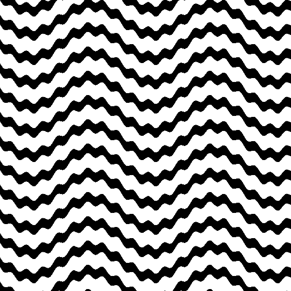

## Hello, glslEditor!

We'll be using Patricio Gonzalez Vivo's glslEditor to experiment with shaders today. This is the editor used of examples by the excellent [The Book of Shaders](https://thebookofshaders.com/) written by Patricio and Jen Lowe.

The glslEditor has many helpful features:
- A live editor powered by Codemirror
- A fullscreen fragment shader context
- Visual Breakpoint Debugging
- Syntax coloring
- Inline errors
- Color and value picking UI widgets


### Inline
The very fastest way to get started is to edit the examples directly on this page. This is good for quick tests and experiments, but you won't be able to save or debug.

### Online
You can also use the hosted editor on the book of shaders.

[Book of Shaders Editor](http://editor.thebookofshaders.com/){boxed right}

### Local
Its also pretty easy to use the editor for local development. For more involved experiments, this is probably best, as you can work in your favorite editor, save and load easily, and use version control just like any other local development project.

This template creates an instance of glslEditor and loads a framgent shader into it.

I'm using VS Code with the "Live Server" exension for local hosting and "Shader languages support for VS Code" for syntax highlighting.

### VS Code Embeded
Even better, you can skip the browser altogether and preview your shaders right in VS Code using the "glsl-canvas" extension, which uses Patricio's library under the hood! This is a pretty compelling option as your projects grow.


```html
<!DOCTYPE html>
<html lang="en">

<head>
    <meta charset="UTF-8">
    <meta name="viewport" content="width=device-width, initial-scale=1.0">
    <meta http-equiv="X-UA-Compatible" content="ie=edge">
    <title>GLSL Workspace</title>
</head>

<body>

    <div id="glsl_editor" data="./my_shader.frag"></div>

    <link type="text/css" rel="stylesheet"
        href="https://rawgit.com/patriciogonzalezvivo/glslEditor/gh-pages/build/glslEditor.css" />
    <script type="application/javascript"
        src="https://rawgit.com/patriciogonzalezvivo/glslEditor/gh-pages/build/glslEditor.js"></script>

    <script lang="javascript">
        let el = document.getElementById("glsl_editor");
        console.log(el);
        const editor = new GlslEditor(el, {
            canvas_size: 512,
            canvas_follow: true,
            canvas_float: 'right',
            menu: true,
            theme: 'monokai',
            lineWrapping: true,
            autofocus: true,
        });
        editor.open(el.getAttribute('data'));
    </script>

</body>

</html>
```


### Hello, World!

Below is a very basic shader that sets every pixel to red. Copy this code into the online editor or your local editor to make sure everything is working. 

::: .full-width
<div class="glsl_editor" data="./hello_world.frag"></div>
/::
<br style="clear: both;"/>


## Basics and Built-ins

`precision` `main` `gl_FragColor` `step` `mod` `floor` `vec2` `vec3` `vec4` `distance` `sin` `domain warping` `swizzling`

### Stripes
::: .full-width
<div class="glsl_editor" data="./stripes.frag"></div>
/::
<br style="clear: both;"/>


### Checkerboard
::: .full-width
<div class="glsl_editor" data="./checkerboard.frag"></div>
/::
<br style="clear: both;"/>

### Rings
::: .full-width
<div class="glsl_editor" data="./rings.frag"></div>
/::
<br style="clear: both;"/>

### Dots
::: .full-width
<div class="glsl_editor" data="./dots.frag"></div>
/::
<br style="clear: both;"/>

### Waves
::: .full-width
<div class="glsl_editor" data="./waves.frag"></div>
/::
<br style="clear: both;"/>


::: .activity

## In-class Challenge

Explore the code examples above by completing the following challenges in order. <br/> Don't skip any.

### Modify the Stripes example

1. Make the stripes horizontal.
2. Make wide white stripes with small black spaces.

### Modify the Checkerboard example

1. Make the checkers smaller
2. Make the checkers wide
3. Find the `mod` call. Change the second parameter to `4.0`. This creates diagonal "stripes". Make the stripes go the other way.


### Modify the Rings example

1. Make the wider.
2. Move the center of the rings.

### Modify the Dots example

1. Make the dots bigger.
2. Make the dots closer.

### Modify the Waves example

1. Increase the frequency of the waves.
2. Increase the amplitude of the waves.

### Challenging Challenges

Make these!

::: .three-up



/::

/::


## Shaping + Mixing

`abs` `min` `max` `clamp` `mix` `smoothstep` `periodic functions` `addative synthesis`


### Disc
::: .full-width
<div class="glsl_editor" data="./disc.frag"></div>
/::
<br style="clear: both;"/>


### Puzzle
::: .full-width
<div class="glsl_editor" data="./puzzle.frag"></div>
/::
<br style="clear: both;"/>

### Moon
::: .full-width
<div class="glsl_editor" data="./moon.frag"></div>
/::
<br style="clear: both;"/>


### Sticker
::: .full-width
<div class="glsl_editor" data="./sticker.frag"></div>
/::
<br style="clear: both;"/>

### Checkerboard 2
::: .full-width
<div class="glsl_editor" data="./checkerboard_2.frag"></div>
/::
<br style="clear: both;"/>


::: .activity

## In-class Challenge

Explore the code examples above by completing the following challenges in order. <br/> Don't skip any.

### Modify the Disc example

1. Make the disc less blury.
2. Make a radial gradient from white out to black.

### Modify the Moon example

1. Remove the small bumps from the horizon.
2. Move the horizon up.
3. Lighten the sky.


### Modify the Sticker example

1. Move the stripe up a little.
2. Make the sticker white, with a black stripe.
  
### Modify the Checkerboard 2 example

1. Make the dark squares middle gray.
2. Make the light squares a gradient from black to white.
  
### Challenging Challenges

Make these!

::: .three-up


/::


/::


## u_resolution, u_time, u_mouse
<!-- 

### Venn
u_resolution, addative blending

::: .full-width
<div class="glsl_editor" data="./venn.frag"></div>
/::
<br style="clear: both;"/>

### Infinite Hills
u_time, paralax

::: .full-width
<div class="glsl_editor" data="./hills.frag"></div>
/::
<br style="clear: both;"/>

### Spotlight
u_mouse, functions
::: .full-width
<div class="glsl_editor" data="./spotlight.frag"></div>
/::
<br style="clear: both;"/> -->


## random
<!-- 
### Checkerboard 3
::: .full-width
<div class="glsl_editor" data="./checkerboard_3.frag"></div>
/::
<br style="clear: both;"/>


### Scattered Dots
::: .full-width
<div class="glsl_editor" data="./scattered_dots.frag"></div>
/::
<br style="clear: both;"/>


### Autopainter
1 circle-on-field painting per second, random background color, random foreground color, random placement
translate

::: .full-width
<div class="glsl_editor" data="./autopainter.frag"></div>
/::
<br style="clear: both;"/> -->


## Signed Distance Fields
<!-- 
### SDF Circle
::: .full-width
<div class="glsl_editor" data="./sdf_circle.frag"></div>
/::
<br style="clear: both;"/>

### SDF Rectangle
rotate
::: .full-width
<div class="glsl_editor" data="./sdf_rectangle.frag"></div>
/::
<br style="clear: both;"/>

### SDF Mix
::: .full-width
<div class="glsl_editor" data="./sdf_mix.frag"></div>
/::
<br style="clear: both;"/>

 -->


<!-- 
### Scales
::: .full-width
<div class="glsl_editor" data="./scales.frag"></div>
/::
<br style="clear: both;"/>
-->

<!-- 
### Diagonal Stripes
::: .full-width
<div class="glsl_editor" data="./diagonal_stripes.frag"></div>
/::
<br style="clear: both;"/>
-->


<!-- 
### Wood
::: .full-width
<div class="glsl_editor" data="./wood.frag"></div>
/::
<br style="clear: both;"/>
-->


<link type="text/css" rel="stylesheet" href="https://rawgit.com/patriciogonzalezvivo/glslEditor/gh-pages/build/glslEditor.css"/>
<script type="application/javascript" src="https://rawgit.com/patriciogonzalezvivo/glslEditor/gh-pages/build/glslEditor.js"></script>
<link type="text/css" href="./shader.css"/>
<script src="./shader_loader.js"></script>

<style>
  .glsl_editor {
    position: relative;
    min-height: 300px;
    
   
  }
  .ge_editor {
    min-height: 300px;
  }
</style>