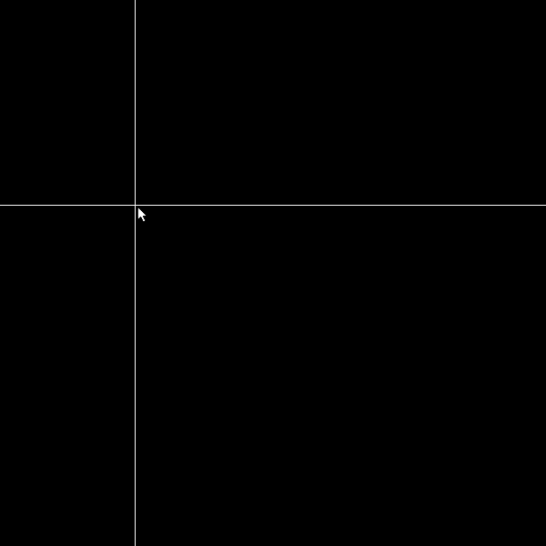

## Uniforms

`u_resolution` `u_time` `u_mouse` `component masks` `functions` `coordinate translation`

### Venn

::: .full-width

<div class="glsl_editor" data="./venn.frag"></div>
/::
<br style="clear: both;"/>

### Infinite Hills

::: .full-width

<div class="glsl_editor" data="./infinite_hills.frag"></div>
/::
<br style="clear: both;"/>

### Spotlight

::: .full-width

<div class="glsl_editor" data="./spotlight.frag"></div>
/::
<br style="clear: both;"/>

::: .activity

## In-class Challenge

Explore the code examples above by completing the following challenges in order. <br/> Don't skip any.

### Modify the Venn Example

1. Make there be 3 circles: Red, Green, and Blue
2. Make one of the circles follow the mouse.

### Modify the Infinite Hills Example

1. Make the hills scroll faster.
2. Add a yellow sun near the horizon.

### Modify the Spotlight Example

1. Make the spotlight have a soft edge.
2. Show a dim version of the pattern in the darkness.

### Challenging Challenges

Make these!

::: .three-up




/::

/::

::: .spoiler

```javascript
out_color *= 1.0 - (step(d, 0.2) - step(d, 0.19));
```

/::

```javascript
precision highp float;

uniform vec2 u_resolution;
uniform float u_time;

float hill_mask(vec2 coord) {
    float hill1 = sin(coord.x * 1.1) * 0.20;
    float hill2 = sin(coord.x * 15.0) * 0.05;
    float hill3 = sin(coord.x * 21.1) * 0.02;
    float hill_mask = step(coord.y, 0.3 + hill1 + hill2 + hill3);
    return hill_mask;
}

float sun_mask(vec2 coord) {
    float d = distance(vec2(0.5, 0.5), coord);
    float sun_mask = step(0.2, d);
    return 1.0 - sun_mask;
}

void main() {
    // boilerplate get normalized coord
    vec2 coord_N = gl_FragCoord.xy / u_resolution;
    coord_N.y /= u_resolution.x / u_resolution.y;

    // calculate sky
    vec3 sky = mix(vec3(0.7, 0.7, 1.0), vec3(0.0, 0.2, 1.0), coord_N.y);

    // start scene
    vec3 scene = sky;

    // composite sun
    vec3 sun_yellow = vec3(1.0, 1.0, 0.0);
    scene = mix(scene, sun_yellow, sun_mask(coord_N + vec2(u_time * 0.04, 0.0)));

    // composite hills
    vec3 hill_green = vec3(0.0, 0.9, 0.0);
    scene = mix(scene, hill_green, hill_mask(coord_N + vec2(u_time, 0.0)));

    // add alpha to scene color, return to pipeline
    gl_FragColor = vec4(scene, 1.0);
}


```

<link type="text/css" rel="stylesheet" href="https://rawgit.com/patriciogonzalezvivo/glslEditor/gh-pages/build/glslEditor.css"/>
<script type="application/javascript" src="https://rawgit.com/patriciogonzalezvivo/glslEditor/gh-pages/build/glslEditor.js"></script>
<link type="text/css" href="./shader.css"/>
<script src="./shader_loader.js"></script>

<style>
  .glsl_editor {
    position: relative;
    min-height: 300px;
    
   
  }
  .ge_editor {
    min-height: 300px;
  }

  .spoiler h3 {
    margin-top: 0;    
}
.spoiler {
    
    position: relative;
}
.spoiler::after {
    content: "Show Spoiler";
    font-family: "Roboto";
    font-size: 10px;
    position: absolute;
    top: 0;
    width: 100%;
    height: 100%;
    text-align: center;
    padding: 30px;
    background: black;
    color: white;
    
}
</style>

<script>
var els = document.getElementsByClassName("spoiler");
for (var i = 0; i < els.length; i++) {
    let el = els[i];
    els[i].addEventListener('click', ()=>el.classList.remove("spoiler"));
}

</script>
