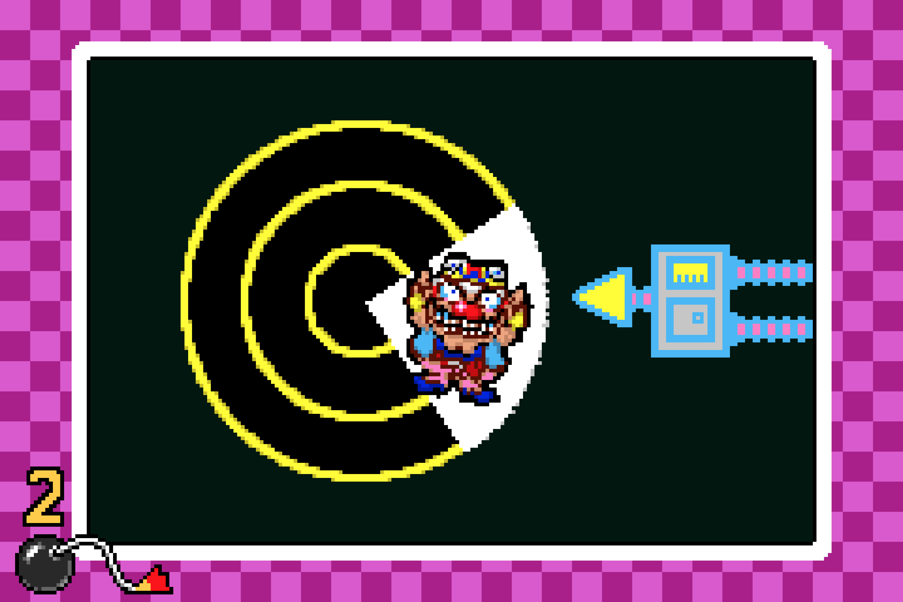

## Microgames

Minigames are small video games included within a larger video game. They are often included to add variety to the larger game or as [easter eggs](https://en.wikipedia.org/wiki/Easter_egg_(media)). BioShock—a first person shooter—used a minigame version of Pipe Dream—a classic puzzler—as the mechanic used to hack doors and machines. Final Fantasy 7 introduced a Chocobo Racing minigame that allowed players to capture, breed, and race large, rideable birds. In Animal Crossing players can decorate their home with playable NES games. 

Some games are made up almost entirely of minigames. Party games like Mario Party, Rayman: Raving Rabbids, and 1-2-Switch allow players to compete in a series of minigame events. Evoland I + II are RPGs that mix many video game styles and mechanics both through minigames and by evolving the presentation of the main game itself.

::: .three-up

BioShock Hacking{figure}

Final Fantasy VII Chocobo Racing{figure}

Animal Crossing NES Collection{figure}

/::

Minigames are are often a beloved part of the games they are in. They offer a change of pace from the main game, reducing fatigue. They are usually low stakes, reducing stress. A well placed minigame can improve the pacing of the main game significantly. Offering an break before a spike in the action will increase the apparent contrast in the intensity. 

Minigames don't have to carry the weight of a full game. They don't have advance the story or provide the amount of mechanics, levels, and content expected of full games. They are free to focus on a small set of ideas, deliver some fun game play, and move on.

The [WarioWare](hhttps://en.wikipedia.org/wiki/Wario_(franchise)) series debuted in 2003 on the Game Boy Advance. WarioWare presented the player with a rapid-fire sequence of microgames. These games pushed the single-minded focus of minigames as far as possible resulting in games that often demanded only a single action from the player and took just seconds to play. As soon as the player completed one challenge, another would begin.

::: .three-up

/::

::: .activity
## What is a Game?

Many interactive artifacts fall into the categories of *games*, *toys*, and *tools*. What is the difference?

### Class, 10 minutes
Group these interactive artifacts into games, toys, and tools. 

Legos, Monopoly, Soccer, Photoshop, Hammers, Tops, Dolls, Chess, Super Mario Brothers, Pac-man, Telephones{bigger}

Do any of these artifacts belong in more than one category?

Do any of these artifacts belong in other, missing categories?

### Groups, 5 minutes
Brainstorm at least 10 defining or characteristic features of games.

### Groups, 5 minutes
Order your features by importance.

### Class, 10 minutes
Compare group lists.

### Class, 5 minutes
Compare features to list of interactive artifacts

/::

## Approaching Libraries

The tools of creative technology change continuously. Computer hardware gets smaller, cheaper, and faster. New software is created and old software is updated. Creative technologists need to continuously learn new tools to make new projects and keep their old projects working.

Being adept at learning new tools is a skill that supports many others, and one of the most valuable skills for working with technology.

::: .activity
## Getting Started with New Tools

In this class, we have explored a number of libraries, languages, mediums, and tools. Reflect on your process for learning new tools.

### Groups, 5 minutes
Brainstorm at least 8 tactics for initially learning about a new tool.

### Groups, 10 minutes
Look at your list of tactics, group similar tactics, and write out a list of the 5 most important tactics. State each tactic clearly in fewer than 10 words.

### Class, 10 minutes
Compare group lists.

/::

 
Here are some of the key tactics I use when learning new tools:

- Read the home page and feature overview.
- Look through the examples. Focus on what it does, not the code.
- Scan the API reference. Note how it is organized an any interesting functions.
- Create a "Hello, World!" from scratch or following a tutorial.
- Look at the examples again. Read the code of an interesting example.
- Modify the example.
- Extend the example.
- Build an original project of small scope.

<!-- [[move this section to new page someday? this isn't tied to microgrames, it is just here because of the class calendar.]] -->

## p5.play

The p5.play library builds on p5.js to add a features common in interactive applications, especially games.

> p5.play provides a <a href="http://p5play.molleindustria.org/examples/index.html?fileName=sprite.js" target="_blank">Sprite</a> class to manage visual objects in <a href="http://p5play.molleindustria.org/examples/index.html?fileName=sprite4.js" target="_blank">2D space</a> and features such as <a href="http://p5play.molleindustria.org/examples/index.html?fileName=sprite3.js" target="_blank">animation support</a>, <a href="http://p5play.molleindustria.org/examples/index.html?fileName=collisions.js" target="_blank">basic collision detection</a> and <a href="http://p5play.molleindustria.org/examples/index.html?fileName=collisions4.js" target="_blank">resolution</a>, sprite <a href="http://p5play.molleindustria.org/examples/index.html?fileName=sprite8.js" target="_blank">grouping</a>, helpers for mouse and keyboard <a href="http://p5play.molleindustria.org/examples/index.html?fileName=keyPresses.js" target="_blank">interactions</a>, and a <a href="http://p5play.molleindustria.org/examples/index.html?fileName=camera.js" target="_blank">virtual camera</a>. 

{bigger}

p5.play homepage{attrib}

- [p5.play homepage](http://p5play.molleindustria.org/)
- [p5.play examples](http://p5play.molleindustria.org/examples/index.html)
- [p5.play api reference](http://p5play.molleindustria.org/docs/index.html)

Since p5.play builds on p5.js it should feel pretty familiar. On key difference is that p5.play provides a scene graph. When you create a new sprite, p5.play remembers that it is part of the scene. When you set the velocity of a sprite, p5.play remembers that for you too. When you call `drawSprites()`, p5.play will move and draw all the sprites. 

## Study Examples

### Example 1: Sprites

::: js-lab
/microgames/sketches/sprites_start.js
/::

### Example 2: Interaction

::: js-lab
/microgames/sketches/interaction.js
/::

::: .activity
## In-class Challenge

Explore p5.play by completing these challenges.

### Modify Example 1
1. Comment out the addImage lines. See what happens. Put them back.
2. Change the size parameters on createSprite. What happens? Why?
3. The kid in green is running backwards. Fix that. Tip: `mirrorX`
4. Make the king run to the right.

### Modify Example 2
1. Comment out the mouseActive line. See what happens. Put it back.
2. Make the king spin when the mouse is over him.
3. Make the king spin when the mouse is NOT over him.
4. Make the king spin when he is clicked, and stop when clicked again.

### Challenging Challenges
1. With Example 1: Make the king and the kid in green run towards each other. Make them stop when they collide. Tip: `overlap()`
2. With Example 2: Remove the king from the scene when he is clicked. Start the scene with 10 kings.
3. With Example 1: Make the king and the kid “bounce” when they collide. Tip: Look at the “bouncing” p5play example.
4. Start making microgames!
/::

::: .assignment

## Keep Sketching!

### Base

This week build interactive experiments that focus minimally expressing a single mechanic. 

### Challenge: Couch Co-op

Cooperative games are games where two or more players work together to achieve a goal. Pandemic, Forbidden Island, and Hanabi are great co-op board games. Portal 2, Lovers in a Dangerous Spacetime, and Towerfall are great co-op videogames.

Couch co-op games are local multiplayer videogames, where two people play together in the same room (on the same couch).

Create a couch co-op microgame!

/::

