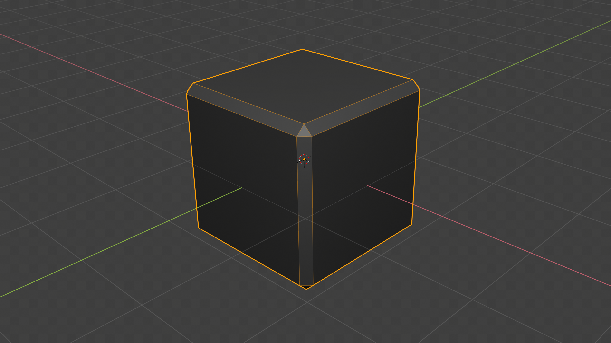

<!-- 

 -->

## Physically Based Rendering

[Physically Based Rendering](https://en.wikipedia.org/wiki/Physically_based_rendering) (PBR) is an approach to rendering graphics based on mathematically simulating how light reacts to surfaces. PBR simulates real-world surface properties including small bumps, roughness, and metallicity making it particullary well suited to photorealistic styles.

PBR shaders are common in both realtime game engines and prerendering engines and the workflow is relatively artist-friendly. Learning PBR texturing is very worthwhile.

Personally, I greatly improved my 3D projects by learning the basics of PBR texturing with Substance Painter.
{bigger}

This [Substance Painter Crash Course](https://www.youtube.com/watch?v=IhBVsn2tfGc&t=949s) video is a pretty good introduction to what working in Substance Painter looks like. It is based on an older version, but the basics are still the same.

## Substance Painter

Substance Painter is a tool that makes working with PBR texture sets easy in multiple ways:

- Directly paint onto your 3D Object instead of the flat texture.
- Paint into all of the textures in the set simultaniously.
- Paint with materials that impact all the surface properties at once.
- Use "smart" materials and masks to automatically add realistic effects like ground dirt, dust, and scratches.
- Non-distructively switch between texture resolutions as needed for faster processing or higher quality display.
- Photoshop like management of layers, folders, and composting.
- View the composite effect with a PBR shader in real-time in the viewport

## Lesson Plan

| Time | Duration | Purpose  | Format   | Name                                      |
| ---- | -------- | -------- | -------- | ----------------------------------------- |
| 3:50 | 15 m     | Study    | Lecture  | Introduction                              |
| 4:05 | 5 m      | Study    | Lecture  | Creating A Project                        |
| 4:10 | 10 m     | Engage   | Hands-on | Creating A Project + Open Play            |
| 4:20 | 5 m      | Study    | Lecture  | Environment and Camera Settings           |
| 4:25 | 5 m      | Engage   | Hands-on | Environment and Camera Settings           |
| 4:30 | 5 m      | Study    | Lecture  | Fill and Paint Layers                     |
| 4:35 | 5 m      | Engage   | Hands-on | Challenge 1 Part 1                        |
| 4:40 | 5 m      | Study    | Lecture  | Baking Maps, Smart Masks, Smart Materials |
| 4:45 | 5 m      | Engage   | Hands-on | Challenge 1 Part 2                        |
| 4:50 | 10 m     | Break    | Break    | Break                                     |
| 5:00 | 5 m      | Study    | Lecture  | Export to Unity                           |
| 5:05 | 5 m      | Engage   | Hands-on | Challenge 1 Part 3                        |
| 5:10 | 30 m     | Activate | Hands-on | Challenge 2                               |
| 5:40 | 30 m     | Activate | Hands-on | Challenge 3                               |
| 6:10 | 30 m     | Engage   | Present  | Show Off Challenge 3 + Voting             |

## Substance Painter Tour

- Creating a Project
  - Template: `PBR - Metallic Roughness (allegorithmic)`
- Interface Overivew
- Environment and Camera Settings
- `play`
- Fill Layers
- Paint Layers
- `challenge`
- Baking Maps
- Smart Masks
- Smart Materials
- `challenge`
- Export to Unity
  - [Substance Painter Docs](https://support.allegorithmic.com/documentation/spdoc/unity-5-130842630.html)
  - Preset: `Unity 5 (Standard Metallic)`

## Challenge 1: Block

Model of a beveled block created in Blender 2.8. [block.blend](./block/block.blend){figure}

Part 1:

1. Download the [block.fbx](./block/block.fbx) model.
2. Create a new Substance Painter project with the model.
3. Create a fill layer on the box, explore setting the color, metallic, and smoothness values.
4. Create a paint layer on the box, paint with different color, metallic, smoothness, and height values.
5. Texture the block to look like a plastic six-sided die.

Part 2:

6. Texture the block to look like a clean concrete block.
7. Texture the block to look like a dirty concrite block.
8. What else can you turn the block into?

Part 3:

9. Export your texture sets and load in unity.

## Challenge 2: Amanita Muscaria

Model of the Amanita Muscaria created in Blender 2.8. [amanita_muscaria.blend](./amanita_muscaria/amanita_muscaria.blend){figure}

::: .two-up .height-300

Image provided by MichaelMaggs [CC BY-SA 2.5](https://creativecommons.org/licenses/by-sa/2.5), from Wikimedia Commons{figure}

Image provided by Tony Wills [CC BY-SA 2.5](https://creativecommons.org/licenses/by-sa/2.5), from Wikimedia Commons{figure}

/::

1. Download the [amanita_muscaria.fbx](./amanita_muscaria/amanita_muscaria.fbx) model.
2. Create a new Substance Painter project with the model.
3. Study some [examples](https://www.google.com/search?q=amanita+muscaria) of Amanita Muscaria mushrooms online.
4. Use Substance Painter to **realisticly** texture the model.
5. Use Substance Painter to **stylisticly** texture the model.

## Big Challenge

- Model + Texture + Create a Scene in Unity
