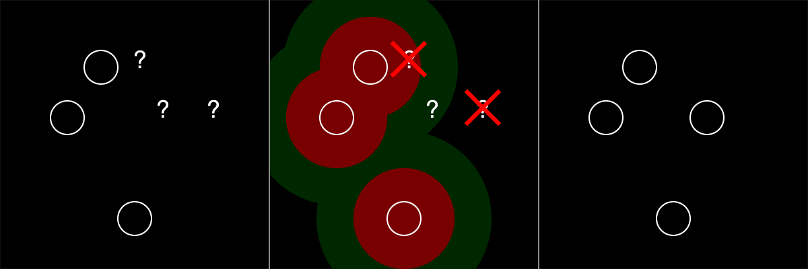
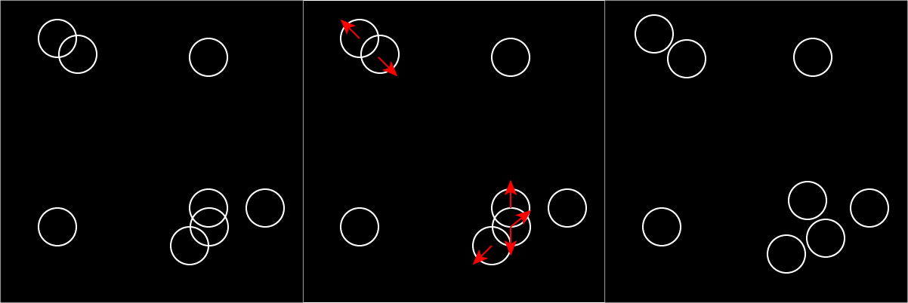

[[ This needs a high level organization pass maybe something like ]]
[[ General introduction to strategic thinking ]]
[[ Description of the problem space (populting points on a square) ]]
[[ Some examples of this problem in practice (games, nature photos, etc) ]]
[[ An overview of the strategiy 1 place 2 move, and place and move tactics ]]
[[ place tactics ]]
[[ move tactics ]]


[[ !! update graphics ]]


## Computational Form Strategies

So far we've been looking at low-level, tactical topics like how to use `random()` and `noise()`. Achieving specific, complex results requires looking at problems from at a higher level. You must first have a clear understanding of the result you would like to achieve, and then begin to plan a series of steps to reach your goal.


[[ (Analyze, Identify Patterns, Compose Solution) borrow list from assignment ]]

::: .activity
## Points on a Square
Consider the image below. How might you make something like this?

{scale full-width}
/::


### Building a Toolbox

As you work in computational form you will find than many problems can be solved using the same techniques composed in different ways. Hopefully you are already seeing that the techniques we have already discussed are building-blocks that can be used to create a wide array of forms. As we explore other tools and media we will see common themes come up again and again.

There are many strategies and patterns widely used procedural generation. Some of the more complex ones have earned their own names: pseudo-random number generation, noise sampling, brownian motion, L-systems, neural nets, turtles, Markov chains, poisson-disc sampling, particle systems, fractals, meta-balls. We've explored some of these already and will touch on others in the course of this class, but you don't need to know all of these techniques to build interesting things. In this chapter we'll be looking at how conceptually simple steps can be combined in different ways to get different effects.

## Populating a Square

[[ clean this up ]]

Today, we will be looking at a single problem domain: placing points on a square. There are countless strategies we might use to place the points depending on the look we want to achieve.


Study each example above:
- How does each example compare to the others?
- What characteristics could be used to group similar examples?
- What kind of plan might you try to achieve each example?


Place   | Move
---     | ---
Random  | Random
Noise   | Noise
Grid    | Relaxation
Cull    | Noise Cull
Tile    | &nbsp;


::: .callout .full-width
{scale}
/::


## Placing the Points

[[ intro to placing]]

### Random Placement
Place each point at a random location on the square.

```
x = random() * width;
y = random() * height;
```

This is a quick, effective, and straight forward way to lay points down. In theory, since the placement is random, all of the points might be placed in a clump or on one half. In practice, the points are mostly evenly distributed over the plane, with some areas a little more or less dense.


### Grid Placement
Place points on grid squares. One way to do this is a nested loop. This approach guarantees a perfectly even distribution.

```
for (row = 0; row < grid_rows; row++) {
	for (col = 0; col < grid_cols; col++) {
		x = (row + .5) / grid_rows * w;
		y = (col + .5) / grid_cols * h;
        ...
	}
}
```


### Noise Placement
Place each point at a location determined by a noise lookup.

- Because noise is center biased, the results will center biased.
- Each dot will be placed near the last as the values change in the noise cloud.
- This technique allows you some control over the proximity of successive points.

```
// loop with _i_
x = noise(i * frequency, 0) * w;
y = noise(i * frequency, 1000) * h;
```


### Cull Placement
Place points randomly, but reject a point if it is too close to an existing point or too far from all existing points.

{scale full-width}

[[ basically unoptimized version of poison disc sampling ]]

### Stamp Placement
Create hand-made (or generated) arrangements of points. Copy these arrangements onto different locations on the square.

- Use this technique or one like it to combine hand-made and procedural design.

{scale full-width}


## Moving the Points


### Random Displacement
Given a set of points, offset the location of each point a random amount. This can be used to roughen up a rigid arrangement like grid placement produces.

```
x = x + random() * width;
y = y + random() * height;
```

### Noise Displacement

Displace each point at by an amount determined by a noise lookup.

- This technique allows for nice control over the frequency of displacement.
- Can be used to create wave-like effects.

```
x = x + noise(i * frequency, 0) * w;
y = x + noise(i * frequency, 1000) * h;
```

### Relaxation Displacement

Find pairs of points that are near each other. Move them towards or away from each other a small amount. This technique is often applied several times in a row with small movements. This avoids the problem of pushing a point away from one, but then into another.

- This technique can be used to push points apart to some minimum distance.
- This technique can also be used to pull points together if they are near each other.
- This technique simulates attractive or repulsive forces acting on the points and can be used to loosely simulate natural phenomenon.

{scale full-width}

### Noise Culling

Sample noise based on the location of the point. Use the sampled value to determine if the point should be culled (discarded).

{scale full-width}


::: .activity
## Match
[[ Match activity ]]
://

## Point Placing Demo
::: js-lab
/comp_form/strategy/sketches/point_place.js
/::


<!-- [Point Placing Demo](https://jsbin.com/telipu/edit?js,output) -->


## Properties of PCG System
When designing a procedural generation system there are several properties to consider. The following properties are borrowed from [PCGBook: Chapter 1](http://pcgbook.com/wp-content/uploads/chapter01.pdf)

### Speed

- How fast does your program need to run?
- Is it okay if takes a very long time to complete?
- Many times a faster running program is harder to code and understand.
- A frame of VR content needs to be rendered in under 10ms, and a short pre-rendered animation may take days to render.

### Reliability

- Does your program need to produce a good result every time?
- Are results shown directly to your audience, or will you have the opportunity to edit?

### Controllability

- Does your program expose any user parameters?
- Do you want explore the parameter space manually?
- Do you want to have tight control over the results or should everything work automatically?

### Expressivity and Diversity

- How much apparent range does your system have?
- Does everything look same-y?
- Is it okay for your output to be completely wild or does it need to satisfy some constraints?
- If you are exposing parameters, do they allow for meaningful control?


### Creativity and Believability

- Do you want your results to look natural or hand-made?
- Is it okay for them to look "computer-y"?
- If your system is generating variations on something that already exists, how closely do you want to copy the original?

### Repeatability

- Do you need the ability to generate the same result more than once?

::: .assignment

## Challenge + Sketch!

### Base
This is the last week of the "Foundation" unit. Look back at the topics covered so far: tile systems, using random, user parameters, using noise, and now thinking strategically.

Begin by completing the challenges for this week.  Completing this week's challenges will result in two posts. **This week the challenges are required.**

Then keep sketching! For the remaining three posts, I encourage you to build a single, more complex sketch and post work in progress as you go.

### Required Challenge 1: Dots A -> B -> X

- **Analyze** the challenge, clearly describe what the sketch does.
- **Strategize** how you would achieve the same effect.
- **Study** the provided starting code.
- **Recreate** the challenge as closely as you can. You may use the starting code, or start from scratch.
- **Extend** the example to create a unique sketch. Try to make something no one else will.
- **Post** your finished sketch.


::: js-lab
/comp_form/strategy/sketches/dot_challenge/sketch.js
/::

[[ hide code above ]]


::: js-lab
/comp_form/strategy/sketches/dot_challenge_start.js
/::


### Required Challenge 2: Line A -> B -> X

Same as above: Analyze, Strategize, Study, Recreate, Extend, Post

::: js-lab
/comp_form/strategy/sketches/line_challenge/sketch.js
/::

[[ hide code above ]]

::: js-lab
/comp_form/strategy/sketches/line_challenge_start.js
/::


/::


::: .assignment

## Reading + Watch + Play


### Read
[Procedural Content Generation in Games](http://pcgbook.com/) is a collection of research in the field of procedural game content. It covers many interesting topics including dungeon+maze generation, fractals, L-systems, generating rules/mechanics, and mixing proc-gen and human-authored content.

[PCG Book, Chapter 1](http://pcgbook.com/wp-content/uploads/chapter01.pdf)


### Watch
[Game Maker's Toolkit](https://www.youtube.com/channel/UCqJ-Xo29CKyLTjn6z2XwYAw) is a Youtube channel that features high-quality video essays on game design.

[GMT: Spelunky](https://www.youtube.com/watch?v=Uqk5Zf0tw3o)


### Play
If you want to play Spelunky—optional but highly recommended—original version (not the HD Remake) is free.

[PC](http://spelunkyworld.com/original.html) or [Mac](https://forums.tigsource.com/index.php?topic=28467.0)


/::


# Related Links
::: .links
[Palm Generator](http://davideprati.com/)
[bl.ocks.org Poison-Disc](https://bl.ocks.org/mbostock/19168c663618b7f07158)
[bl.ocks.org Poisson-Disc II](https://bl.ocks.org/mbostock/dbb02448b0f93e4c82c3)
[Devmag.org Poisson Disk](http://devmag.org.za/2009/05/03/poisson-disk-sampling/)
[Points on a Sphere](https://www.jasondavies.com/maps/random-points/)
/::