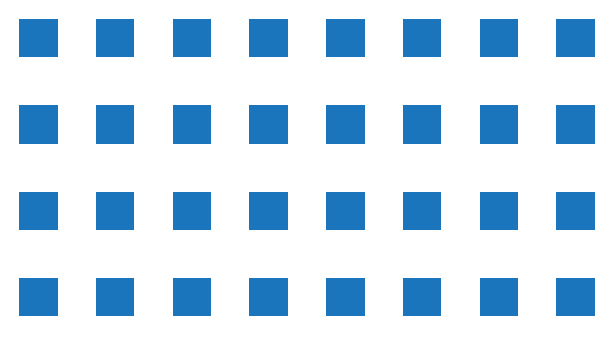

<script src="https://cdnjs.cloudflare.com/ajax/libs/p5.js/0.5.16/p5.min.js"></script>
<script src="../mess/noise_mess_3.js"></script>


## Noise

Random values are extremely common and important in procedural generation. They are also hard to work with in many situations. Psuedo-random number generators are designed to provide independent, unpredictable, and evenly-distributed values. If we want *related* or *repeatable* random values we have to do extra work.

Noise functions are often a better source of random values. 

There are several common noise functions, each with different characteristics. The most widely known noise function is probably [Perlin noise](https://en.wikipedia.org/wiki/Perlin_noise), developed by Ken Perlin while working on visual effects for the amazing 1982 motion picture [*Tron*](http://www.imdb.com/title/tt0084827/). Ken later developed a similar and faster version called [simplex noise](https://en.wikipedia.org/wiki/Simplex_noise). Other noise functions include [Worley noise](https://en.wikipedia.org/wiki/Worley_noise), developed by Steven Worley, and the simpler [value noise](https://en.wikipedia.org/wiki/Value_noise).


::: .three-up


Perlin Noise{figure}


Worely Noise{figure}


Value Noise{figure}

/::


Noise functions provide a "cloud" of random values that can be used in a wide variety of ways. Noise functions are very frequently used in procedural texture generation and terrain generation. More generally, noise functions can be thought of as a lookup table of pre-generated random values and used in place of `random()` in many cases.


::: slides .!short .cover
@@include('./slides.yaml')
/::


<!-- ::: .discussion

# Blue Squares


/:: -->


## Using Noise

::: .callout
{scale}
/::

Consider the code you would write to draw the blue squares above. You need to provide several values for each square: horizontal position, vertical position, width, height, and color.

Where do those values come from? They could come from a few places.


| Source     | Purpose                                                         |
| ---------- | --------------------------------------------------------------- |
| Hard Coded | You want specific control of the value.                         |
| Parameters | You want to be able to control the value from a larger context. |
| `random()` | You want random variation.                                      |
| `noise(x)` | You want controlled variation.                                  |

Now suppose we wanted to add variation to the size of the squares. Both `random()` and `noise()` would allow us to do that, but `noise()` provides much more control. With `random()` the sizes of the boxes won't be related at all. With `noise()` we can control how quickly the size changes horizontally, vertically, and over time. If we sample a small area of the noise function the variation will be subtle and gradual. If our samples are far apart the variation will be be drastic and unpredictable and look a lot like `random()`.


### Random()


::: js-lab
/noise/sketches/sketch_random/sketch.js
/::


### Noise(x)

::: js-lab
/noise/sketches/sketch_noise/sketch.js
/::


Consider the two examples above: one uses `random()` and one uses `noise()`.

| random()                                                                                                                           | noise()                                                                                                                                       |
| ---------------------------------------------------------------------------------------------------------------------------------- | --------------------------------------------------------------------------------------------------------------------------------------------- |
| It's easy to control the range of values provided by `random()`.                                                                   | It is also easy with `noise()`.                                                                                                               |
| The values provided by `random()` are independent and unrelated. The circles change size at high frequency and with no transition. | The values provided by `noise()` are arranged spatially. The frequency of size changes is more easily controlled.                             |
| Achieving repeatable results with `randomSeed()` applies globally. You have to freeze the big circle and the circle line together. | Achieving repeatable results with `noise()` is more flexible. You can freeze the circle line without changing the behavior of the big circle. |
| Good                                                                                                                               | Great                                                                                                                                         |


## Benefits of Noise

### Noise Looks Good
The `noise(x)` function returns values sampled from Perlin noise. Perlin noise provides random values that are aesthetically arranged. The variation in Perlin noise is band-limited: it is even, without flat or noisy areas. The variation is also visually isotropic—it looks the same at different rotations. These characteristics make it a useful basis for many applications that require natural-feeling variation.


### Noise is Repeatable
Repeated variation is easy with `noise(x)`: every time you call `noise(x)` with a particular argument, you get the same value back. This can be very useful. For example, in an animation you often need a value to stay the same from frame to frame.

- `random()` requires no arguments and returns a different random value every time.
- `noise(x)` requires an argument and returns the same random value _for that argument_ every time.

This difference is a core reason why `noise(x)` is so useful. This difference takes some getting used to, and learning what to pass in for `x` takes some practice.

### Noise is Controllable
By controlling what you pass to `noise(x)`, you can control the frequency of the values returned. This can be used to control how quickly values vary in space and time. Like `random()` values, you can scale and shift the values from `noise(x)` to the range you need. You can also adjust the character of `noise(x)` using `noiseDetail()`.


### 1D Noise Example
::: js-lab
/noise/sketches/sketch_1D_noise/sketch.js
/::

::: .activity
## Building 1D Noise
How does the `noise(x)` function work? Explore the underlying concepts by building a simplified noise function with pencil&nbsp;and&nbsp;paper.


### Instructions
- Roll 1d12 for each square on the sheet and plot the value on the graph.
- Connect the plotted points with straight lines or a smooth curve.
- According to your hand-made noise function, what is the value of `noise(3)`, `noise(4)`, and `noise(6.5)`?

<p class="boxed download">
    <a href="../handouts/1d_noise_graph.svg" download>1d_noise_graph.svg</a>
</p>


/::

### 1D, 2D, + 3D Noise

`noise(x)`


`noise(x, y)`


`noise(x, y, z)`


## Working with Noise


### Calling the Noise Function

The `noise()` function takes up to three parameters: `noise(x,y,z)` allowing you to request values arranged in a three dimensional "cloud" of pseudo-random values.

When you call `noise(x)` you have to pass in at least one parameter. This parameter specifies the location in the cloud of the value to return. You can think about `noise(x)` as a lookup table: `noise(1)` provides one value in the table and `noise(2)` provides another. 

Choosing appropriate parameter values takes some getting used to. You can pass in `frameCount` or `millis()` to get values that change over time. You can pass in XYZ coordinates to get values that change over space. These are very common cases, but really you can pass values from any range into `noise()` and it will provide random values in return.


### Controlling the Frequency
You can control the frequency of returned values by scaling the values you pass in for `x`, `y`, and `z`.

```javascript
// get a value that changes over time
n = noise(frameCount); 

// get a value that changes over time more slowly
n = noise(frameCount * .1); 

// get a value that changes over time more quickly
n = noise(frameCount * 10); 

```

### Controlling the Amplitude and Range
The `noise(x)` function returns values in the range of 0 to 1. Use multiplication and addition to shift this range to the range you need. Be aware that while `random()` provides evenly-distributed values, `noise()` values are biased towards the middle.

```javascript
// scale values to sit between 10 and 20;
n = noise(frameCount) * 10 + 10; 
```

You could also use `map()`:

```javascript
// get values from 0 to 1
n = noise(frameCount); 
// map to 10 to 20
n = map(n, 0, 1, 10, 20);  
```

### Controlling the Detail

::: .links-sidebar
[p5:<br/>noiseDetail()](https://p5js.org/reference/#/p5/noiseDetail)
/::

The `noiseDetail()`  function allows you to control the "roughness" or "detail" of the noise returned. 


### Controlling the Seed

::: .links-sidebar
[p5:<br/>noiseSeed()](https://p5js.org/reference/#/p5/noiseSeed)
/::


By default, every time you restart your sketch the noise pattern will be different. The `noiseSeed()` allows you to manually set the noise pattern seed. 


## Study Examples
The following study examples demonstrate different ways of using noise to get different looks and effects. Some of these examples are similar to the examples in the [Random Values](../random) chapter. Carefully study each example to understand how it works. Several of the examples offer different approaches which can be commented in and out to compare their results.

### Mapping Noise
::: js-lab
/noise/sketches/study_2D.js
/::

### Grass
::: js-lab
/noise/sketches/grass.js
/::

### Skyline
::: js-lab
/noise/sketches/skyline.js
/::


::: .activity
## In-class Challenge

Explore using noise by completing the following challenges in order. <br/> Don't skip any.


| Time                | Comment                                                                              |
| ------------------- | ------------------------------------------------------------------------------------ |
| < 7 in 20 Minutes   | You need to put in some extra work to strengthen your understanding of these topics. |
| 7 in 20 Minutes     | Good.                                                                                |
| All 9 in 20 Minutes | Great.                                                                               |


### Modify the Mapping Noise Example
1. This example shows several ways of mapping noise. Comment in and out each example, and compare the results.

### Modify the Grass Example
1. Study the code and get a general idea of how it works.
2. Line 28 has two magic constants: `.01` and `.001`. Try changing the first constant to `.1`. What happens? What happens when you change it to `1`?
3. Set the first constant back to `.01`. Change the second constant to `.01`. What happens?
{continue}

### Modify the Skyline Example
1. This example has two global parameters: `amplitude` and `frequency`. Change the values of these parameters to get a feel for how they affect the output. What happens when you use a very small value for frequency, such as `.001`?
2. On line 23, what would happen if you changed `noise(x * frequency)` to `noise(x * frequency, frameCount)`? Make the change. Is that what you expected?
3. Your last change should have caused the bar heights to animate very quickly. Slow down the rate of change.
{continue}

### Challenging Challenges
1. Add flowers to some of the blades of grass.
2. Add water towers to some of the buildings.
{continue}


/::


::: .assignment

## Keep Sketching!

### Base
This week, focus on using the `noise()` function. Use `noise()` in a variety of ways. Use 1D, 2D, and 3D noise. Try using high, mid, and low frequency noise. Try using noise to control different things: position, size, color, rotation, etc. Think about tile graphics, `random()`, and parameters while you work. Consider combining these concepts with `noise()`.


### Challenge: Treasure Map

Make a program that generates treasure maps.

#### Your maps should

- Describe the geography of a fictional territory
- Mark the location of the treasure
- Include a path to the treasure from a reference point (optional)
- Be expressed in a cohesive style

#### Things to consider

- Where is your treasure? On a tropical island? On a farm? In a warehouse?
- What style is your map? Is it old and beaten? Sci-fi? 
- Does your map include labels? What do they say?
- Can you make a believable natural geography? Should you?
- What terrain features might you include? Rivers? Mountains? Hills? Boxes?
- It is okay if your map takes seconds or even minutes to generate.
- A map can represent many things—it doesn't necessarily need to represent geography.

#### When posting your map

- Include three maps generated by your program.
- Each map should be shown as an image, not a video.
- Consider posting a first run at this challenge early, and then revisiting it towards the end of the week with a second post.


/::


## Reference Links


[Pinterest: Perlin Noise](https://in.pinterest.com/explore/perlin-noise/)
: Active Pinterest search for *Perlin Noise Art*

[Book of Shaders: Noise](https://thebookofshaders.com/11/)
: Chapter on using noise in GLSL shaders from the excellent *The Book of Shaders*.

[Shiffman: 2D Noise](https://www.youtube.com/watch?v=ikwNrFvnL3g)
: [Daniel Shiffman's](http://shiffman.net/about/) video on 2D Perlin noise 


[Ken Perlin: Noise and Turbulence](http://mrl.nyu.edu/~perlin/doc/oscar.html)
: Comments on Perlin noise direct from the source, including the code.

[GPU Gems: Improved Perlin Noise](https://developer.nvidia.com/gpugems/GPUGems/gpugems_ch05.html)
: Ken Perlin details an improved implementation of Perlin noise for [GPU Gems](https://developer.nvidia.com/gpugems/GPUGems/gpugems_pref01.html)

[Lecture: Juicing your Cameras With Math](https://www.youtube.com/watch?v=tu-Qe66AvtY)
: GDC talk on making cameras cooler. At 11:40 he discusses the benefits of using Perlin noise instead of RNG for camera shake.