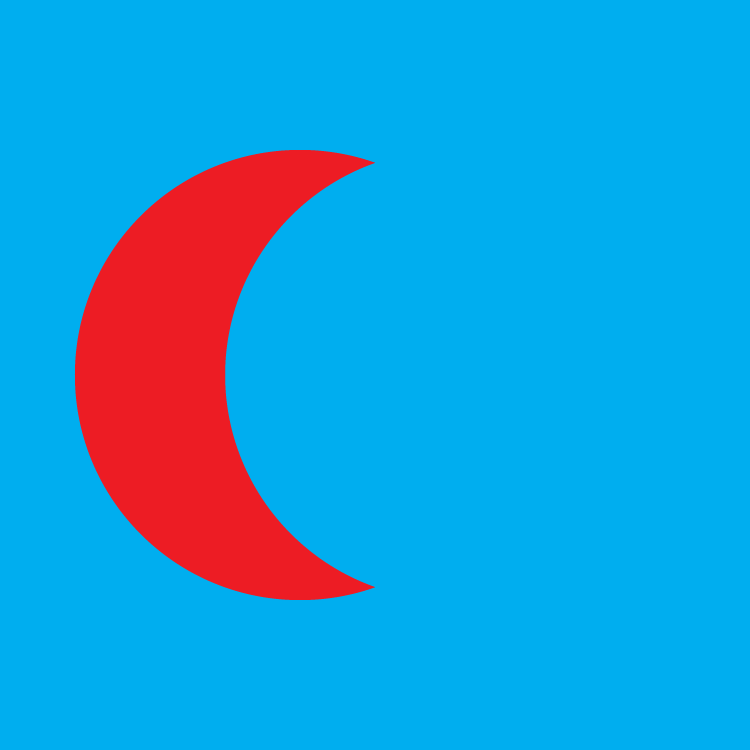
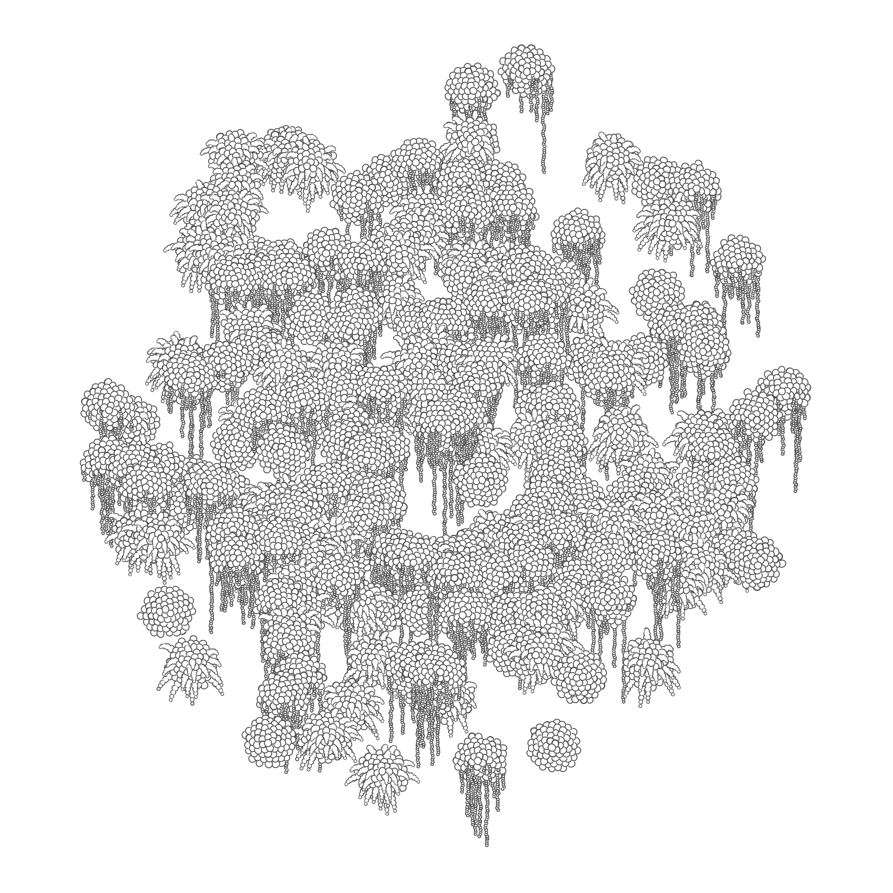

## Vector Data

Last week, we worked directly with **pixels**, the fundamental unit of raster graphics. Today we will work with vector graphics, which represent images as collections of **shapes**. Scalable Vector Graphics, or `svg`, is a common XML-based vector graphics format. SVG files look like this:

```xml
<?xml version="1.0" encoding="UTF-8" ?>
<svg xmlns="http://www.w3.org/2000/svg" viewBox="0 0 360 144">
    <rect fill="#092" y="89.43" width="360" height="54.57"/>
    <rect fill="#0af" width="360" height="90"/>
    <rect fill="#fff" x="252" y="54" width="36" height="36"/>
    <polygon fill="#f00" points="288 54 270 36 252 54 288 54"/>
</svg>
```

::: .no-margin
<svg xmlns="http://www.w3.org/2000/svg" viewBox="0 0 360 144">
    <rect fill="#092" y="89.43" width="360" height="54.57"/>
    <rect fill="#0af" width="360" height="90"/>
    <rect fill="#fff" x="252" y="54" width="36" height="36"/>
    <polygon fill="#f00" points="288 54 270 36 252 54 288 54"/>
</svg>
/::

Vector graphics must be converted to raster graphics—a process called [rasterization](https://magcius.github.io/xplain/article/rast1.html)—in order to be viewed on a pixel-based display. Fortunately, it is easy to rasterize vector graphics: vector graphics contain all the information necessary to do so. It is _not_ easy to convert from raster images to vector images: In order to do so we would have to make inferences about the meaning implied by the raster image. When the form is ambiguous our inferences are just guesses, and they may be wrong. 

<!-- [[ recipe vs finished dish? you can go one way, not the other. you can easily remove salt from a recipe, you can't easily remove salt from a dish]] -->


::: .activity
## Felt Board
Compare creating scenes using direct mark making vs. cut-out shapes.

### Setup
Divide class into groups. Give some groups flet and scissors and the other group paper and makers.

### Create
*Groups, 5 minutes*

Using only the materials on the table, create a scene that includes a car.

Before you begin, consider the elements that will make up your image of the car: wheels, doors, windows. 

### Share
*Individually, 2 minutes*

Look around the room at what the other groups have made.

### Discussion
*Groups, 5 minutes*

*Class, 5 minutes*

- What are the benefits to creating the scene from felt?
- What are the benefits to creating the scene with paper and markers?
- What are the drawbacks to each?
- What qualities emerge from the two approaches?
- How would you approach animating this scene using the tools you were given?


/::

### Meaning vs. Form

Consider the image below. What would the image look like if the black circle were removed?


::: .three-up

We might infer that a red circle lies behind the black one.{figure}


The red shape might be a crescent instead. Or it could be something else entirely. We don't know.{figure}


We don't know if the blue background should continue either.{figure}
/::

When we look at the image, we quickly infer that it represents two overlapping circles on a blue rectangle, but the raster image doesn't contain information about shapes at all. It contains only blue, red, and black pixels. Humans are very, very good at inferring meaning from visual forms. We fill in meaning without conscious thought. When we look at the image above we see the circles automatically. 

::: .callout
Humans are so good at inferring visual meaning that it can be difficult for us to separate our inferences from our direct observations. In _Stranger in a Strange Land_ (1961), Robert A. Heinlein explores this idea. One of the book's characters is a _fair witness_, a person who has trained themselves to carefully observe and report what they see without drawing inferences.

> Anne was on the springboard; she turned her head. Jubal called out, "That house on the hilltop—can you see what color they've painted it?"
>
> Anne looked, then answered, "It's white on this side."
>
> Jubal went on to Jill: "You see? It doesn't occur to Anne to infer that the other side is white, too. All the King's horses couldn't force her to commit herself...unless she went there and looked—and even then she wouldn't assume that it stayed white after she left."

/::

Because we are so good at inferring meaning, meaning is always there. We don't appreciate how limited we would be without it. Computers are not good at inferring meaning from form. A human can guess that a red circle lies behind the black one, but a computer can't—so the human can imagine the drawing without the circle, and the computer can't. 

This is the key advantage of vector graphics over raster graphics: **vector graphics contain high-level _meaning_** about the image that they represent. They are built from semantic units like rectangles and ellipses instead of nonsemantic pixels. This meaning allows us to make high-level changes: we can scale the vector image up and perfectly fill in the needed additional detail; we can change the fonts used to render text; we can remove a shape and reveal what is behind it. 

::: .callout

Actually, computers _can_ infer meaning from images, they just need to be programmed to do so. This is an extremely active area of research, and the rate of progress in recent years is staggering. This research is already making its way to consumer tools—Photoshop introduced [Content-Aware Fill](https://research.adobe.com/project/content-aware-fill/) in 2010—and current approaches are actually **better than humans** at specific tasks.

The [Two Minute Papers](https://www.youtube.com/channel/UCbfYPyITQ-7l4upoX8nvctg) channel on YouTube summarizes graphics and AI research papers. Here are some great videos:

- [Two Minute Papers: AI Learns Semantic Image Manipulation](https://www.youtube.com/watch?v=XhH2Cc4thJw)
- [Two Minute Papers: Physics-based Image and Video Editing](https://www.youtube.com/watch?v=bVGubOt_jLI)
- [Two Minute Papers: Deep Image Prior](https://www.youtube.com/watch?v=_BPJFFkxSbw)
- [Two Minute Papers: Image Colorization with Deep Learning and Classification](https://www.youtube.com/watch?v=MfaTOXxA8dM)
- [Two Minute Papers: Learning to Fill Holes in Images](https://www.youtube.com/watch?v=psOPu3TldgY)
/::


## A Hybrid Workflow

Using a vector-based graphics library allows us to computationally generate images, export them in a way that preserves their shape information, and further manipulate them in vector editing software.

::: .callout


Top: Vector Output<br/>Middle: Illustrator » Effect » Stylize » Round Corners...<br/>Bottom: Illustrator » Custom Pattern Brush{figure}
/::


## Paper.js

This chapter introduces [Paper.js](http://paperjs.org/), developed by [Jürg Lehni](http://lehni.org) and [Jonathan Puckey](http://jonathanpuckey.com).

> Paper.js is an open source vector graphics scripting framework that runs on top of the HTML5 Canvas. It offers a clean Scene Graph / Document Object Model and a lot of powerful functionality to create and work with vector graphics and bezier curves, all neatly wrapped up in a well designed, consistent and clean programming interface.

[About Paper.js](http://paperjs.org/about/){attrib}

You can find an overview of Paper.js [features](http://paperjs.org/features/), a set of [tutorials](http://paperjs.org/tutorials/), and a complete [API Reference](http://paperjs.org/reference/global/) on the Paper.js site.


### PaperScript vs. JavaScript
Paper.js is a JavaScript library, and can be used with JavaScript alone, but can also be used with PaperScript. Paper.js is easier to use with PaperScript, at least for small projects. You can find info on setting up your workspace here: [Working with Paper.js](http://paperjs.org/tutorials/getting-started/working-with-paper-js/)

You can use PaperScript with this site's code example editor. You can tell the editor you are using PaperScript with a special comment: `// language paperscript`.

Here is an example of a Paper.js program written in PaperScript:

::: js-lab
/vectors/sketches/basic_paperscript.js
/::


#### Library Exports
If you use Paper.js as a Javascript library, you will access the library through the `paper` object. In PaperScript, the library contents are exported to the scope of the program and can be accessed directly. 

Javascript:
```javascript
var path = new paper.Path();
```

PaperScript:
```javascript
var path = new Path();
```

#### Operator Overloads
PaperScript also lets you use mathematical operators to work with Point and Size objects. You can see this on line 12. `circle1Location + new Point(100, 0)` adds two points together. JavaScript is not able to overload operators like this: this is a feature of PaperScript.

#### `Let` Does Not Work in PaperScript
Javascript now allows you to declar variables with `let` and `const`, but PaperScript uses only `var`


### Retained Mode vs. Immediate Mode

The p5.js library is an _immediate mode_ graphics library. When you call `rect()` or `ellipse()`, p5.js immediately draws the shape to the canvas.

Paper.js is a _retained mode_ graphics library. When you call `Path.Rectangles()` or `Path.Ellipses()`, Paper.js creates object instances to represent the shapes and adds them to a _scene graph_. The scene graph can then be changed. You can add and remove shapes and change their properties. The shapes in the scene graph are all drawn to the canvas at once, when you are done making changes to it.

Creating an animation in p5.js involves constructing and drawing the entire canvas every frame. Paper.js redraws the shapes in your scene graph every frame, so all you have to do is change the properties of your animated shapes.

::: js-lab
/vectors/sketches/animation.js
/::

Notice that we don't need to create the rectangle or the ellipse in every `onFrame()` call. We don't need to mention the background rectangle at all, once it is in the scene graph. Paper.js will draw it every frame until we remove it. We also don't need to set the color of the circle every frame. We can set it just when it changes, and that information is also stored in the scene graph.


### SVG Output

Since Paper.js works in retained mode and stores your drawing as a vector scene graph, you can export your scene as an `svg` drawing that you can open in a vector editor like Adobe Illustrator. 

The `Project.exportSVG()` function will create `svg` data of your Paper.js project. You need to do a little more work to download this data as a file. You can use the `downloadAsSVG()` in the example below to export your sketches. To export the example click it to focus it, and then press the `s` key.

::: js-lab
/vectors/sketches/output.js
/::


### Basic Example

::: js-lab
/vectors/sketches/example_basic.js
/::


### Boolean Example
A super-useful feature of Paper.js is the ability to combine shapes with boolean operations. This allows you to describe complex shapes by building them from primitives.

::: js-lab
/vectors/sketches/example_boolean.js
/::


::: .activity
## In-class Challenge


Explore Paper.js by modifying the examples above. Work through the following challenges in order. Don't skip any.


| Time                 | Comment                                                      |
| -------------------- | ------------------------------------------------------------ |
| < 11 in 20 Minutes   | Keep studying to improve your understanding of these topics. |
| 11 in 20 Minutes     | Good.                                                        |
| All 15 in 20 Minutes | Great.                                                       |


### Modify the Basic Example
It might help to have the documentation for [Paper.js Path](http://paperjs.org/reference/path/) handy.

1. Make both lines 8 pixels wide and blue. 
2. Set the `.strokeCap` of both lines to `round`.
3. Make 50 lines with random start and end points.
   
   You don't have the p5.js `random()` function in Paper.js, but you do have JavaScript's `Math.random()`. This will get you a random value between 0 and 500: `Math.random() * 500`.
4. Make each of the 50 lines a random width and color.
{continue}


### Modify the Boolean Example
5. Make the green square 500 pixels wide.
6. Change the function that creates comboPath from `subtract` to `unite`.
7. Change the function again. This time try `intersect`.
8. Change the green square to an ellipse.
9. Remove the green and red shapes, leaving only the compound shape. Tip: `.remove()` [docs](http://paperjs.org/reference/path/#remove).
{continue}


### Challenging Challenges
10. Starting from scratch, draw a simple stick figure.
11. Create a compound shape from _three_ shapes using any of the boolean operations: `unite`, `intersect`, `subtract`. Tip: You'll need to do this in two steps.
12. Create the drawing below.
{continue}


::: js-show
/vectors/sketches/challenge.js
/::


/::


## Project Case Study

Paper Garden is a program written in about 300 lines of PaperScript using [Paper.js](http://paperjs.org/). It generates stylized drawings of plants arranged in a wall garden. Read about how this program works and explore the code.

[Paper Garden Case Study](./paper_garden/paper_garden.html){boxed right}




::: .assignment


## Keep Sketching!

### Base
Explore using Paper.js. Focus on creating vector-based images this week. I highly encourage you to use a hybrid workflow this week: start with code in Paper.js but finish with manual work in Illustrator.{bigger}

This week you must complete at least one of the following challenges. These challenges count as 2 sketches. Post one work-in-progress screenshot sketch, and a second sketch with a photo of the final output.

### Challenge: Promo Poster
Create a promotional poster for a real or fictional event. Your poster must be printed in color at 24"x24" or greater. Your poster should promote a specific event (of your choosing) and must include a generative vector element and text describing the title, date, and location of the event.

### Challenge: Lasercut Anything
Create a lasercut thing. This can be anything you like that combines generative vector data and laser cutting or etching.

**Complete your posts before our next class and bring your posters and laser cuts to class!**

/::

## Reference Links


[YesYesNo: Más Que la Cara](https://medium.com/@zachlieberman/m%C3%A1s-que-la-cara-overview-48331a0202c0)
: An interactive installation in downtown Houston using paper.js and facial detection.

[Autodraw](https://www.autodraw.com/)
: A Google AI experiment that interprets sketches, using Paper.js for the draw area.

[Plumin.js](http://www.pluminjs.com/)
: Javascript typeface editing using Paper.js.

[Variable Fonts](https://v-fonts.com/)
: Experiment with OpenType customizable typefaces.


<!-- 
Describe the steps taken to make a drawing
Describe the shapes in the drawing
Describe the results of the steps -->


<!-- Droodles
Roger Price's Droodles were minimal cartoons that played with the ideas of inferred meaning and ambiguity. 

One of Prices's Droodles was used as the cover art for Frank Zappa's 1982 album _Ship Arriving Too Late to Save a Drowning Witch_.  -->

<!-- 
Semantics vs Form vs Syntax

"Colorless green ideas sleep furiously"
Noam Chomsky https://en.wikipedia.org/wiki/Colorless_green_ideas_sleep_furiously -->
<!-- 


```
for i = 1 to 10
    circle i, 10
```

```
circle 1, 10
circle 2, 10
...
```

```
[0, 0, 0, 255, 0, 0, 0, 255,...]
``` -->
